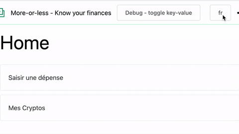

# i36n
Translation manager twice simpler and twice better

## Installation
### As [npm](https://www.npmjs.com/package/i36n) dependency in your node project

Simply install it as a dependency of the project you want to internationalize.
```shell
npm install i36n
```

## Usage

This module follow the provide/inject pattern, available in Vue. This means that you will first have to provide the translator on a top level part of your application.

Then you can inject it wherever you need it.

### Provide
Somewhere before you need your first label, you have to provide the library to your app.
In your `<script>` tag first import the library:
```js
import { provideI36n } from 'i36n'
```

In your `setup()` function, call the `provideI36n()` function. You need to pass it 2 parameters:
1. the language identifier (en, de, fr), in a reactive variable (in the example below, it's a prop)
2. An object containing the `load` function. The `load` function is used to... load the labels for the chosen language. In the example below, we are simply asynchronously fetching the labels in a local file, but you can also load them with an XHR request or in any other way.

```html
<script>
import { provideI36n } from 'i36n'
// ... imports, etc..

const load = async lang => (await import(`@/i18n/${lang}.json`)).default

setup(props) {
  provideI36n(props.language, { load })
}
</script>
```

If you pass a 3rd argument (a Vue app instance) to the `provideI36n`, it will provide the feature on the app directly.

```js
const app = createApp(App, { ... })
provideI36n(props.language, { load }, app)
```
Internally, it will call `app.provide`, instead of the standalone `provide` function.

### Inject
Once the providing is done, you can inject the library features anywhere in your app by using the `useI36n()` function.

In your `<script>` tag, near the top, import the library
```js
import { useI36n } from 'i36n'
```

In your `setup()` function, call the `useI36n()` function. It will give you the `t()` translation function.

```js
setup() {
  const { t } = useI36n()

  // other cool stuffs
  // ...
  const meal = ref('kebab')

  return { t, meal }
}
```

In your template (or inside your setup function, further), use it.

```html
<h1>{{ t('food_title') }}</h1>
<p>{{ t('food_favorite', { meal }) }}</p>
```

Assuming that your current language translation file looks like this:
```json
{
  "food_title": "Some great meals",
  "food_favorite": "My favourite meal is {meal}. Yummy!"
}
```
The above template will resolve in:
```html
<h1>Some great meals</h1>
<p>My favourite meal is kebab. Yummy!</p>
```

## And the killer feature
You can pass a `showKey` property in the `provideI36n()` second parameter, along with the `load` method. This `showKey` must be a reactive variable (a `ref`) containing a Boolean.

As long as its value is `false`, you won't notice anything. But if you change the value to `true`, the `t()` function will display the label keys and the needed placeholders instead of resolving the label.

This is incredibly useful while you develop, trust us.

Here is a demo:


